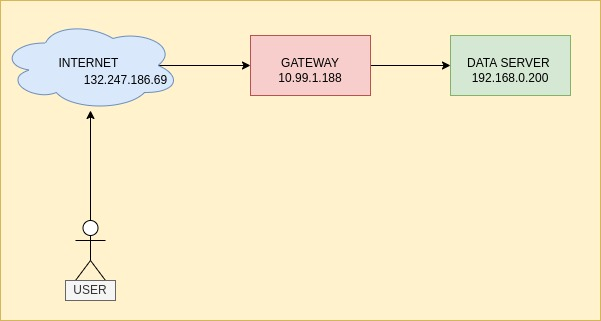

# Distibutive Analysis of the Graphics Processing Unit (GPU) Market


## Team_Members
* [Mariela Arias Rojo](https://github.com/marielaAriass)
* [Ángel Flores Ayala](https://github.com/AngelFA04)
* [Jadiel Zuñiga Rodriguez](https://github.com/JZRodriguez)


## Table of Contents
* [Team_Members](#Team_Members)
* [Introduction](#Introduction)
* [Objectives](#Objectives)
* [Development](#Development)
* [Tools](#Tools)
* [How_to_use_it?](#How_to_use_it?)
* [References](#References)


## Introduction
#### What?
The aim of this project is to get an insight of the current state of the [Graphics Processing Units](https://www.hellotech.com/blog/whats-a-gpu-what-gpu-do-you-have) market giving the current global situation, including the global pandemic and the shortage on raw materials by using distributive computing. 
The insight is specifically in the GPU model NVIDIA RTX 3060 reference edition


#### How?
By making use of distributive computing

#### Why?
Graphics Processing Units are a powerful tool used for entertainment and for data analysis.
The specific product is a staple in the Graphics Industry, so it's important to get its insight in the current market.


## Objectives
Develop different servers to analyze and process the data given
* Server to collect data : By getting from different online stores (Amazon, official website)
* Server to store data : Using services like a MySQL database
* Server to process data : By charting the time with respective price by the different retailers
* Server to display data : By graphing the data


## Development



The image above represents the arquitecture of the system used for this project.

The instructions to use the spider of this project are [here](https://github.com/JZRodriguez/distributive_computing_project/blob/main/gpu_scraper/README.md).

The average execution script time for the spider is 2 minutes. Each execution downloads an average of 90 datas, so it gives it an average of 1.33s per data, with a deviation of 0.1, giving a latency of 1.43s


## Tools
The main instruments used are:
* Python 3
* Linux Ubuntu 64-bit


Libraries from Python:
* [Numpy](https://numpy.org/)
* [Pandas](https://pandas.pydata.org/)
* [Matplotlib](https://matplotlib.org/)
* [Scrapy](https://scrapy.org/)
* [SQLAlchemy](https://www.sqlalchemy.org/)

## How_to_use_it?
To use this project first it is necessary to have all the dependencies, you can do it running this command:
```sh
pip3 install -r requirements.txt
```
Also, it is important to create a file inside the `database` folder that stores the database credentials and the csv folder. The file should be named `config.ini`

```sh
cd database
touch config.ini
nano config.ini
```
Once the editor is open, paste this template, but using your own variables
```
[POSTGRES]
USER=
PASSWORD=
HOST=
PORT=
DATABASE_NAME=

[CSV]
FOLDER=/your-folder-location
```


Then you have to run the spider in order to get the data necessary.
```sh
cd gpu_scraper
python3 -m scrapy crawl gpus-spider -o gpus.csv
```

Finally you have to run the script that handle the upload of all the data into the database.
```sh
cd database
python3 load.py
```

## References
What’s a GPU? Everything You Need to Know. (2021, 12 abril). The Plug - HelloTech. Recuperado 26 de abril de 2022, de https://www.hellotech.com/blog/whats-a-gpu-what-gpu-do-you-have

