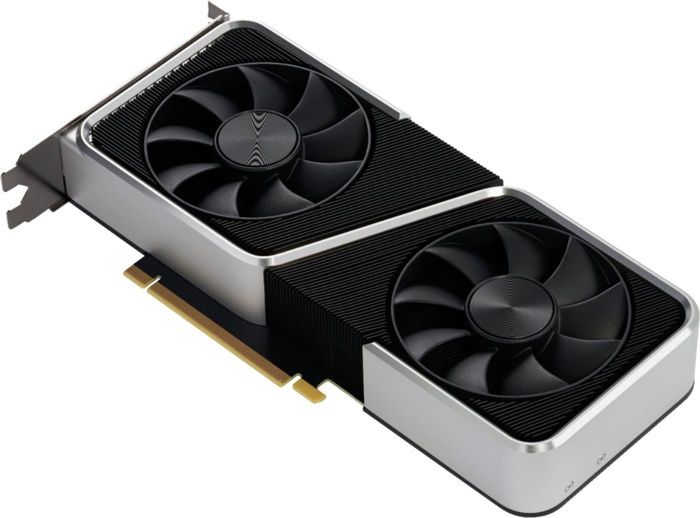

# Distibutive Analysis of the Graphics Processing Unit (GPU) Market

## Team_Members
* [Mariela Arias Rojo](https://github.com/marielaAriass)
* [Ángel Flores Ayala](https://github.com/AngelFA04)
* [Jadiel Zuñiga Rodriguez](https://github.com/JZRodriguez)

## Table of Contents
* [Team_Members](#Team_Members)
* [Introduction](#Introduction)
* [Objectives](#Objectives)
* [Tools](#Tools)

## Introduction
#### What?
The aim of this project is to get an insight of the current state of the [Graphics Processing Units](https://www.hellotech.com/blog/whats-a-gpu-what-gpu-do-you-have) market giving the current global situation, including the global pandemic and the shortage on raw materials by using distributive computing. 
The insight is specifically in the GPU model NVIDIA RTX 3060 reference edition

#### How?
By making use of distributive computing

#### Why?
Graphics Processing Units are a powerful tool used for entertainment and for data analysis.
The specific product is a staple in the Graphics Industry, so it's important to get its insight in the current market.

## Objectives
Develop different servers to analyze and process the data given
* Server to collect data : By getting from different online stores (Amazon, official website)
* Server to store data : Using services like a MySQL database
* Server to process data : By charting the time with respective price by the different retailers
* Server to display data : By graphing the data

## Tools
The main instruments used are:
* Python 3
* Linux Ubuntu 64-bit

Libraries from Python:
* Numpy
* Pandas
* Matplotlib
* Scrapy

## References
What’s a GPU? Everything You Need to Know. (2021, 12 abril). The Plug - HelloTech. Recuperado 26 de abril de 2022, de https://www.hellotech.com/blog/whats-a-gpu-what-gpu-do-you-have

